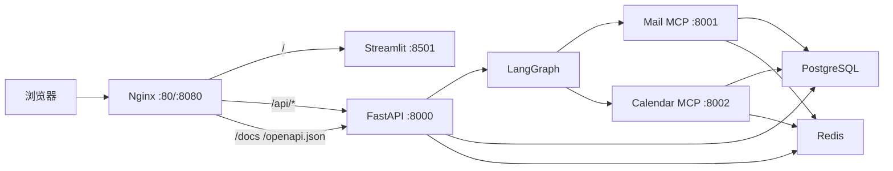

# MailPilot 部署与运维说明

## 1. 部署目标

当前交付面向单台 Linux 服务器或受控本地环境，使用 Docker Compose 运行：

- Nginx：唯一公共入口。
- FastAPI：业务 API、Agent 启动、审批恢复和 SSE。
- Streamlit：中文工作台。
- Mail MCP / Calendar MCP：内部工具服务。
- PostgreSQL：业务数据、Checkpoint 和长期 Store。
- Redis：登录限流、写操作短锁和短期状态。
- migrate：一次性完成 Alembic、LangGraph Checkpointer 和 Store 初始化。

当前拓扑是单节点部署基线，不等同于 Kubernetes 多副本高可用集群；性能结论仅采用已记录测试环境和样本下的实测结果。

## 2. 部署拓扑



生产覆盖文件不发布 PostgreSQL、Redis、FastAPI、Streamlit 和 MCP 的宿主机端口，只发布 Nginx。MCP 路径也被 Nginx 显式返回 404。

## 3. 开发环境启动

### 3.1 准备配置

```powershell
Set-Location <mailpilot-repository>
Copy-Item .env.example .env
```

必须替换：

- `POSTGRES_PASSWORD`
- 两个数据库 URL 中的密码
- `REDIS_PASSWORD`
- 两个 Redis URL 中的密码
- `JWT_SECRET_KEY`
- `MCP_INTERNAL_TOKEN`
- 三个 `LLM_*` 模型变量

URL 中的特殊字符必须进行百分号编码。真实 `.env` 不得提交 Git。

### 3.2 一条主要命令启动

```powershell
docker compose --env-file .env up --build -d
```

启动完成后：

- 统一工作台：<http://localhost:8080>
- OpenAPI：<http://localhost:8080/docs>
- Nginx 健康：<http://localhost:8080/healthz>
- API 就绪：<http://localhost:8080/api/v1/health/ready>

开发环境内部服务只绑定 `127.0.0.1`，便于本机排错：

- FastAPI：8000
- Streamlit：8501
- Mail MCP：8001
- Calendar MCP：8002
- PostgreSQL：5432
- Redis：6379

### 3.3 只读部署验收

```powershell
uv run python backend/scripts/verify_deployment.py --base-url http://localhost:8080
```

脚本检查 Nginx、FastAPI、PostgreSQL/Redis 就绪、Streamlit、OpenAPI、JWT 保护和 MCP 公网隔离，不执行业务写操作。

## 4. 单机生产部署

### 4.1 服务器准备

- 安装 Docker Engine 和 Compose Plugin。
- 只对外开放 80；配置 TLS 后开放 443。
- 数据库、Redis、API、UI 和 MCP 不对公网开放。
- 生产机通过防火墙、安全组或企业 VPN 限制管理入口。
- 准备域名和 TLS 终止方案。第一版建议由云负载均衡或反向代理处理证书。

### 4.2 生产配置

```bash
cp .env.production.example .env.production
```

替换所有 `CHANGE_ME`。然后执行不会回显秘密的预检：

```bash
docker run --rm \
  -v "$PWD:/workspace" \
  -w /workspace \
  mailpilot-app:0.1.0 \
  python backend/scripts/check_environment.py --env-file .env.production
```

首次尚未构建镜像时，也可以在已安装项目依赖的本地虚拟环境执行：

```bash
python backend/scripts/check_environment.py --env-file .env.production
```

### 4.3 生产启动命令

```bash
docker compose \
  --env-file .env.production \
  -f docker-compose.yml \
  -f compose.production.yaml \
  up --build -d
```

生产覆盖文件负责：

- `ENVIRONMENT=production`
- `DEBUG=false`
- 只公开 Nginx
- 所有长期服务使用 `restart: always`
- CORS 默认空列表，同源页面通过 Nginx 访问 API

### 4.4 验收

```bash
docker compose \
  --env-file .env.production \
  -f docker-compose.yml \
  -f compose.production.yaml \
  ps

python backend/scripts/verify_deployment.py --base-url http://server.example.com
```

预期：

- postgres、redis、backend、frontend、mail-mcp、calendar-mcp、nginx 为 healthy。
- migrate 为 `Exited (0)`。
- `/mcp` 返回 404。
- 未携带 JWT 访问 `/api/v1/users/me` 返回 401。

## 5. 启动顺序

```text
PostgreSQL healthy
Redis healthy
→ migrate 执行业务迁移、Checkpoint 和 Store 初始化
→ backend 启动并通过 /ready
→ frontend 启动并通过 /_stcore/health
→ Nginx 启动并对外服务

PostgreSQL + Redis + migrate
→ 两个 MCP Server 启动并通过 /health
```

`depends_on` 只控制顺序，`condition` 才表达健康或成功退出：

- `service_healthy`：长期服务必须已经可用。
- `service_completed_successfully`：迁移任务必须退出码为 0。

## 6. Nginx 规则

- `/api/` 转发 FastAPI。
- `/docs`、`/redoc`、`/openapi.json` 转发 FastAPI 文档。
- `/` 和 `/_stcore/` 转发 Streamlit。
- SSE 禁用 `proxy_buffering`，避免事件攒在 Nginx 内迟迟不发。
- WebSocket 转发 `Upgrade` 和 `Connection`。
- `/mcp`、`/mail-mcp`、`/calendar-mcp` 明确返回 404。
- 添加基础安全响应头和 5 MB 请求体限制。

TLS 证书、域名和企业负载均衡因部署环境而异，本仓库不硬编码。

## 7. 日常运维

### 7.1 查看状态和日志

```bash
docker compose --env-file .env ps
docker compose --env-file .env logs --tail=200 nginx backend
docker compose --env-file .env logs --tail=200 mail-mcp calendar-mcp
docker compose --env-file .env logs --tail=200 postgres redis
```

Nginx upstream 使用 Docker 内置 DNS `127.0.0.11` 动态解析 `backend` 和 `frontend`。因此应用容器重建并更换 IP 后，网关会在短 TTL 内刷新地址，不要求人工重启 Nginx。

排查一次请求时优先搜索响应中的 `request_id`，再结合 `agent_run_id`、`thread_id` 和 Langfuse Trace。

### 7.2 更新代码

```bash
docker compose --env-file .env build
docker compose --env-file .env up -d
```

`migrate` 会在应用容器前运行。迁移失败时 backend 不会启动，不要跳过迁移强行运行新代码。

### 7.3 停止

```bash
docker compose --env-file .env stop
```

普通停止不会删除数据卷。`docker compose down -v` 会删除 PostgreSQL 和 Redis 卷，除非明确准备清空数据，否则不要执行。

## 8. 备份与恢复

备份前确认输出目录存在且权限安全：

```bash
docker compose --env-file .env exec -T postgres \
  pg_dump -U mailpilot -d mailpilot -Fc > mailpilot.backup
```

恢复必须在已确认目标数据库和备份文件后执行：

```bash
docker compose --env-file .env exec -T postgres \
  pg_restore -U mailpilot -d mailpilot --clean --if-exists < mailpilot.backup
```

恢复是破坏性操作，生产环境应先在隔离数据库验证备份可用，并安排维护窗口。

## 9. 常见故障

| 现象 | 检查顺序 |
|---|---|
| Nginx 502 | backend/frontend 健康状态、Nginx 上游日志 |
| SSE 很久才出现事件 | `proxy_buffering off`、代理超时和浏览器断线 |
| Streamlit 页面开但不断重连 | WebSocket Upgrade 头、`/_stcore/health` |
| Nginx 自身 healthy，但 API/OpenAPI 返回 502 | backend 是否 healthy、upstream 是否启用 Docker DNS 动态 `resolve` |
| backend 不启动 | migrate 是否退出 0、数据库 URL、JWT 配置 |
| ready 返回 503 | PostgreSQL/Redis 健康和密码 |
| 所有登录共享限流 | Uvicorn 是否信任 Nginx 转发头、是否绕过 Nginx |
| MCP 通过公网可访问 | 生产端口是否错误发布、Nginx 是否缺少阻断规则 |
| 重启后审批无法恢复 | PostgreSQL 卷、Checkpoint 表、原 thread_id |
| Langfuse 不可用 | 核心流程应继续；查看 No-op 降级日志 |

## 10. 生产边界

当前方案提供单机生产部署基线，适用于受控网络中的内部业务系统。面向高可用、多副本或大规模负载时还需要：

- TLS 自动续期、WAF 或云负载均衡。
- 托管 PostgreSQL/Redis、备份保留和灾难恢复演练。
- 外部持久任务队列替代 FastAPI 进程内 BackgroundTasks。
- 多副本下的迁移锁、Worker 协调和集中日志告警。
- Gmail、Outlook 或飞书真实 OAuth Provider。
- 企业 SSO、密钥管理系统和令牌撤销。
