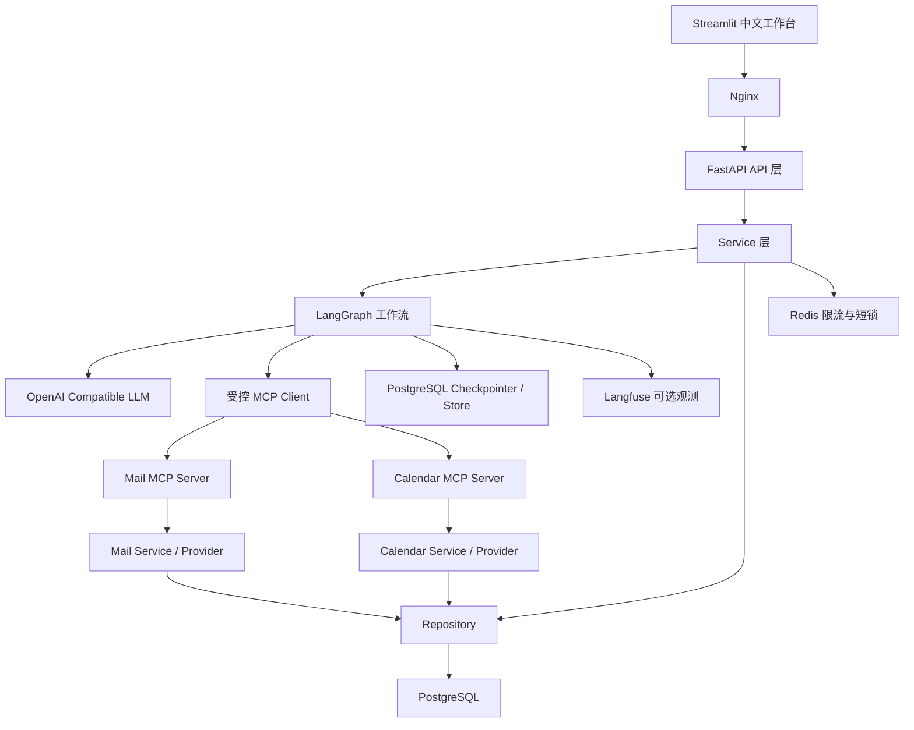

# MailPilot 系统架构说明

## 1. 架构目标

MailPilot 的重点不是训练模型，而是把大模型放进受控业务工作流：

- LLM 负责理解邮件、提取意图和生成候选方案。
- Python 负责权限、状态机、安全不变量、条件路由和结束条件。
- LangGraph 负责编排、暂停、Checkpoint 和恢复。
- MCP 负责跨进程工具协议。
- Service/Repository 负责真正的业务规则和数据库。
- 人工审批负责确认危险写操作。

## 2. 总体架构



## 3. 核心数据流

```text
API 收到邮件处理请求
→ JWT 得到 user_id
→ Service 创建 AgentRun
→ thread_id 作为 LangGraph Checkpoint 键
→ 加载业务记忆并同步长期 Store
→ LLM 返回结构化分类、意图和计划
→ Python 条件边决定下一节点
→ 只读 MCP 工具自动执行
→ 生成回复或会议方案
→ 危险操作进入 interrupt
→ ApprovalRequest 和 Checkpoint 持久化
→ 用户审批时使用 Command(resume=...)
→ MCP Server 二次检查审批、参数和幂等键
→ Service/Provider 修改 PostgreSQL
→ AgentRun、ToolCallLog、AuditLog 和 Trace 收尾
```

## 4. ID 和存储职责

| 标识/存储 | 职责 |
|---|---|
| `user_id` | 数据所有者和长期记忆隔离 |
| `thread_id` | LangGraph 短期执行状态的暂停恢复 |
| `agent_run_id` | 产品层一次 Agent 任务和 Langfuse Trace 关联 |
| `request_id` | 一次 HTTP 请求的日志排查 |
| Checkpointer | 当前 Graph State、下一节点、interrupt |
| Store | 跨 thread 的运行时长期记忆副本 |
| MemoryProfile | 可查看、修改、删除、版本化的业务事实 |
| AgentRun | 页面展示的运行状态和安全摘要 |
| AuditLog | 谁在何时做了什么 |

## 5. 分层职责

| 目录 | 职责 |
|---|---|
| `backend/app/api/` | HTTP、鉴权依赖、请求/响应，不写核心业务 |
| `backend/app/agent/` | State、节点、路由、Graph、Prompt、安全策略 |
| `backend/app/services/` | 业务用例、事务和状态变化 |
| `backend/app/repositories/` | 带 user_id 的数据库查询 |
| `backend/app/providers/` | 本地邮箱/日历实现及真实平台替换边界 |
| `backend/app/integrations/` | LLM 和 MCP 外部调用适配 |
| `backend/app/memory/` | LangGraph Store 和长期记忆同步 |
| `backend/app/observability/` | Langfuse/No-op 观测边界 |
| `mcp_servers/` | 薄 MCP 协议入口，不复制业务逻辑 |
| `frontend/` | 只调用 FastAPI 的中文 Streamlit 工作台 |
| `evals/` | 数据集、运行器、指标、Judge 和报告 |
| `nginx/` | 公共入口、SSE/WebSocket 代理和 MCP 隔离 |

## 6. 为什么不是自由循环 Agent

自由循环 Agent 让模型不断决定下一步，初始实现成本较低，但运行风险和不确定性更高。MailPilot 使用确定性 Graph：

- 允许的节点和边在代码中可见。
- 模型只能返回 Pydantic 结构。
- 工具数量有上限。
- 工具白名单由 Python 控制。
- 写操作只能经过固定审批节点。
- 每条分支都有明确终点。

LLM 提供“理解和候选决策”，Python 提供“最终执行边界”。

## 7. 安全边界

```text
不可信邮件/反馈
→ Prompt 数据区隔离
→ Pydantic Schema
→ Python Policy
→ 工具白名单
→ user_id Repository 隔离
→ interrupt 人工审批
→ MCP Server 二次校验
→ Redis 短锁
→ PostgreSQL 幂等事实
→ AuditLog
```

任何单层都不是百分百防线，组合后形成纵深防御。

## 8. 扩展点

- LocalMailProvider → Gmail/Outlook/飞书邮件 Provider。
- LocalCalendarProvider → Google/Outlook/飞书日历 Provider。
- OpenAI Compatible LLM → DeepSeek、Qwen 或其他兼容服务。
- NoOpObservability → Langfuse。
- FastAPI BackgroundTasks → 持久任务队列。
- 单机 Compose → 企业云托管服务。

Provider 替换不能绕过 Service、审批和幂等规则。
